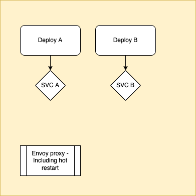

# Deployment based rules

## General requirements
User will be able to deploy more than on deployment:
1. User will choose topology:
   1. Weighted.
   2. Rule based:
      1. First deployment will be the default one (Use will be able to change it afterwards)
         1. When deploying use will be prompt to define rules which route to this deployment:
         ```json
          {
            "name": "...",
            "exact_match": "...",
            "safe_regex_match": "{...}",
            "range_match": "{...}",
            "present_match": "...",
            "prefix_match": "...",
            "suffix_match": "...",
            "contains_match": "...",
            "string_match": "{...}",
            "invert_match": "..."
          }
          ```
         > Based on envoy headers rules [link](https://www.envoyproxy.io/docs/envoy/latest/api-v3/config/route/v3/route_components.proto#envoy-v3-api-msg-config-route-v3-headermatcher
      )
         2. Choose to be default deployment.

## POC

1. Implementing server which simulate deployment with `/predict` endpoint - [dockerfile](server/Dockerfile).
2. Build envoy proxy with hot reload mechanism from configmap - [dockerfile](envoy/Dockerfile).

## Example
1. Generate token:
```shell
ACCESS_TOKEN=$(curl \
    --location 'https://grpc.qwak.ai/api/v1/authentication/qwak-api-key' \
    --request POST \
    --header 'Content-Type: application/json' \
    --data '{"qwakApiKey": ""}' | jq -r '.accessToken')
```
2. Predict while adding header with server name:
```shell
curl \
    --location 'https://models.donald.qwak.ai/v2/play/predict' \
    --request POST \
    --header 'Content-Type: application/json' \
    --header "Authorization: Bearer $ACCESS_TOKEN" \
    --header "server_name: b" \
    -v
```


## Additional notes

* [XDS server](https://github.com/stevesloka/envoy-xds-server)
* [Configmap delay](https://kubernetes.io/docs/concepts/configuration/configmap/)
